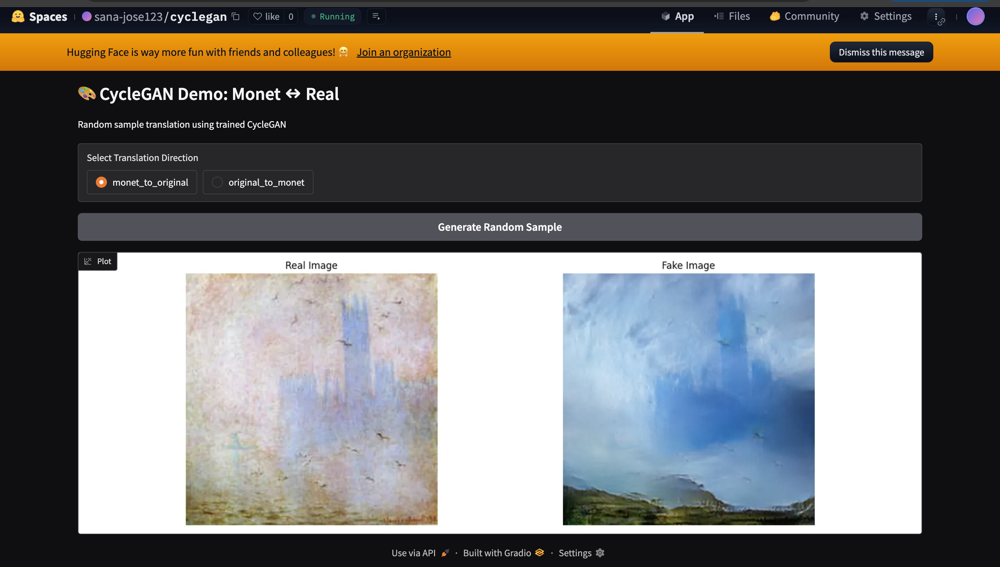

# CycleGAN: Monet ↔ Real Photo Translation

This project implements a CycleGAN model for unpaired image-to-image translation between:

- Monet-style paintings → Real-world photographs  
- Real-world photographs → Monet-style paintings  

The model is trained using the Monet2Photo dataset and deployed with an interactive Gradio interface.

---

##  Live Demo

Try the deployed version here:  
https://huggingface.co/spaces/sana-jose123/cyclegan

- Choose translation direction
- Generate random test samples
- View side-by-side comparison
- Runs entirely in the browser

---

##  Demo Preview

<p align="center">
  
</p>

---

##  What I Implemented

- Full CycleGAN architecture in PyTorch
- Generator and Discriminator networks
- Adversarial loss (GAN loss)
- Cycle-consistency loss
- Identity loss
- Custom dataset pipeline
- Random jitter data augmentation
- Training loop with checkpoint saving
- Inference pipeline
- Visualization module
- Interactive frontend using Gradio
- Deployment to Hugging Face Spaces

---

## 💻 Running Locally

###  Clone the Repository

```bash
git clone https://github.com/sana-jose/cyclegan_implementation.git
cd cyclegan_implementation
 ```

 ###  Create a Virtual Environment
Mac/Linux:
```bash
python -m venv venv
source venv/bin/activate
 ```

Windows:
```bash
python -m venv venv
venv\Scripts\activate
 ```

```bash
pip install -r requirements.txt
 ```
## Download Pretrained Checkpoint

The pretrained model weights are hosted on Hugging Face Spaces.

You can download them from:

[Download checkpoint](https://huggingface.co/spaces/sana-jose123/cyclegan/resolve/main/checkpoints/checkpoint_epoch_143.pth)

After downloading, place the file inside the `checkpoints/` folder in your project:

 ```bash
python app.py
 ```

After running the command, Gradio will print a local URL in the terminal, such as:

```
http://127.0.0.1:7860
```

Open the URL shown in your terminal in your browser to access the application.
